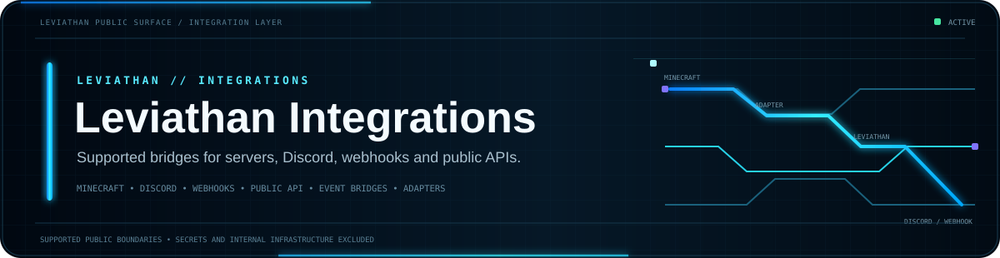
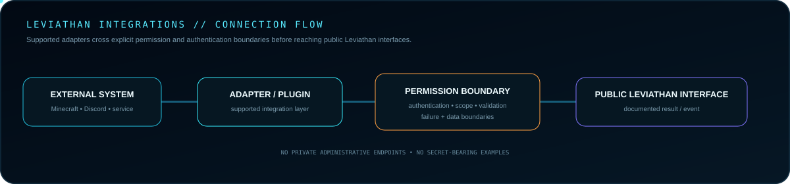
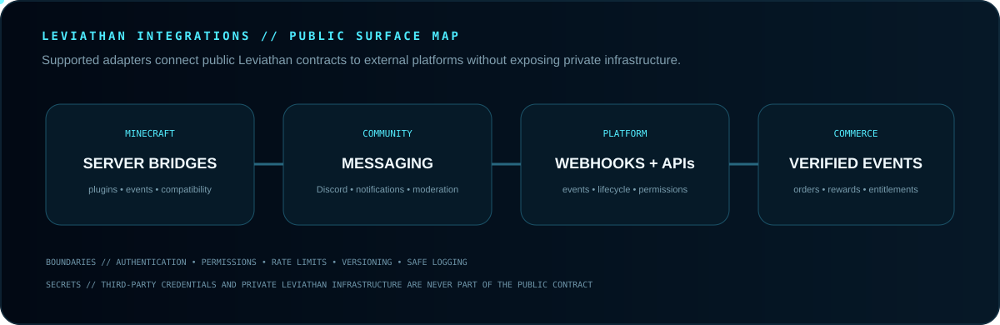
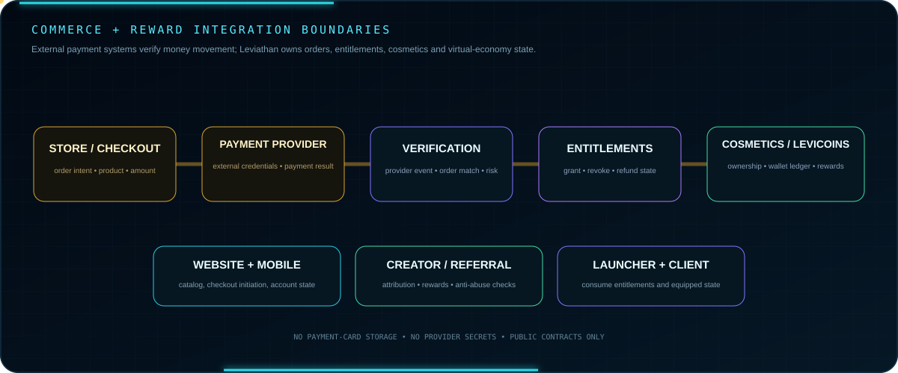

 

**Public integration patterns for connecting Leviathan with supported platforms and services.**

[Guide](GUIDE.md) · [API Docs](https://github.com/Lapinite/Leviathan-API-Docs) · [SDK](https://github.com/Lapinite/Leviathan-SDK) · [Examples](https://github.com/Lapinite/Leviathan-Examples) · [Security](SECURITY.md)

## Integration architecture

Every public integration defines authentication, permissions, configuration, supported versions, failure behavior and data boundaries.

## Public surface map

Minecraft, community, platform and commerce adapters stay behind explicit public contracts. Private infrastructure remains private.

## Commerce and reward boundaries

Payments remain inside the payment-provider boundary. Leviathan consumes verified events and maintains product entitlement, ledger and audit state.

## External service boundaries

Microsoft, Xbox, Minecraft/Mojang, Discord, payment providers, webhooks and Minecraft servers remain separate trust boundaries with their own authentication, permission, rate-limit, privacy and availability requirements.

Leviathan integrations expose only the minimum supported public contract. They must not embed third-party credentials, payment secrets, bypass entitlement or authentication controls, or leak private Leviathan infrastructure.

## Compatibility

Compatibility is documented per integration as implementations become available. Planned integrations are not represented as production-ready until tested and intentionally released.

## Security boundaries

Integrations must never contain real bot tokens, webhook credentials, payment-provider secrets, API secrets, private keys, database credentials, personal information, internal infrastructure addresses or private administrative endpoints.

Configuration examples use placeholders or environment-variable names, and logs must avoid secrets, payment data, access tokens and sensitive user data.

## Navigation

<a href="GUIDE.md#minecraft-plugins"><strong>Minecraft</strong></a> ·
<a href="GUIDE.md#discord"><strong>Discord</strong></a> ·
<a href="GUIDE.md#webhooks"><strong>Webhooks</strong></a> ·
<a href="GUIDE.md#permissions"><strong>Permissions</strong></a> ·
<a href="GUIDE.md#authentication-boundaries"><strong>Authentication</strong></a> ·
<a href="GUIDE.md#lifecycle"><strong>Lifecycle</strong></a> ·
<a href="GUIDE.md#support"><strong>Support</strong></a>

## Related repositories

<a href="https://github.com/Lapinite/Leviathan-API-Docs"><strong>API Docs</strong></a> ·
<a href="https://github.com/Lapinite/Leviathan-SDK"><strong>SDK</strong></a> ·
<a href="https://github.com/Lapinite/Leviathan-Examples"><strong>Examples</strong></a> ·
<a href="https://github.com/Lapinite/Leviathan-Server-Tools"><strong>Server Tools</strong></a> ·
<a href="https://github.com/Lapinite/Leviathan-Docs"><strong>Docs</strong></a>

## License

This repository uses the Apache License 2.0. See [LICENSE](LICENSE).
